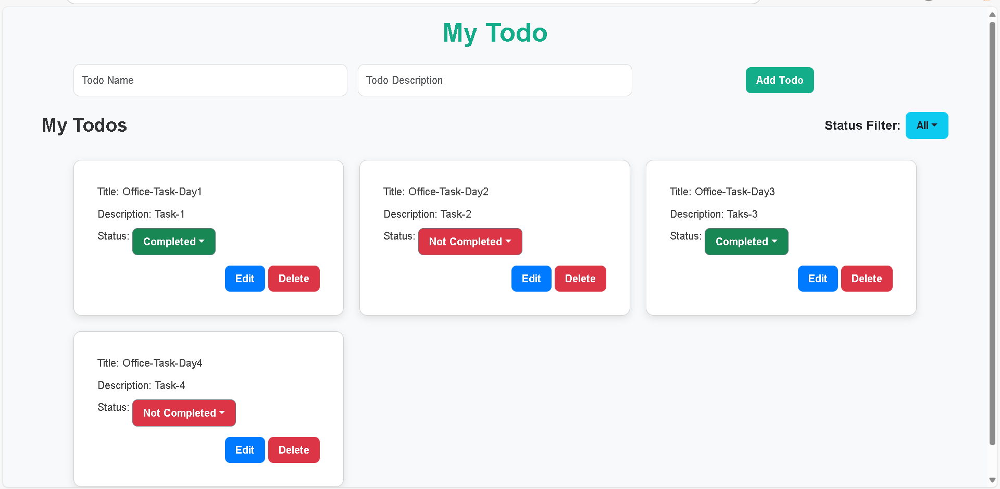
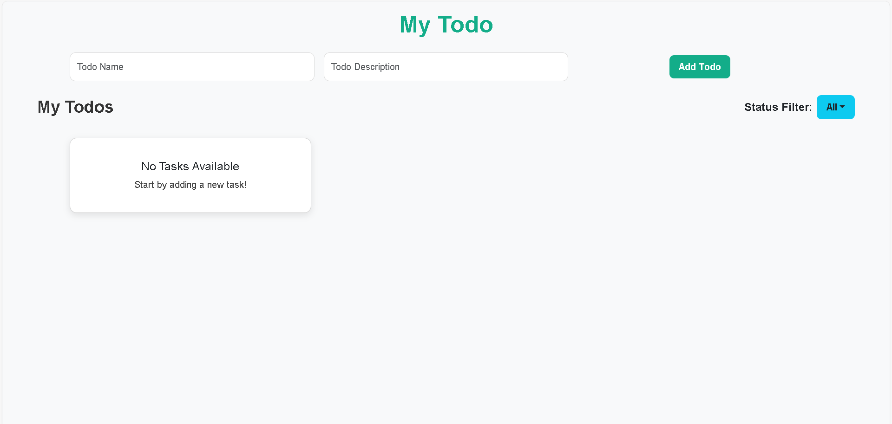

# React Todo App ✅

## 🌟 Overview

A responsive **Todo Application** built with **React.js**, featuring **task creation, editing, deletion, and filtering**. Includes a **modern UI, smooth animations, and status filtering with a dropdown menu**.

## 🚀 Features

- 📝 **Add, Edit, Delete Todos**
- ✅ **Mark Todos as Completed or Not Completed**
- 🔍 **Filter Todos (All, Completed, Not Completed)**
- 🎨 **Modern & Responsive UI with Bootstrap**
- 🔄 **Persistent Data with LocalStorage (optional)**
- 🔗 **React Router for Navigation & Dynamic Editing**
- ⚡ **Fast & Optimized State Updates**

## 🛠️ Tech Stack

- React.js
- React Router DOM
- Bootstrap 5
- CSS Animations

## 📷 Screenshot

